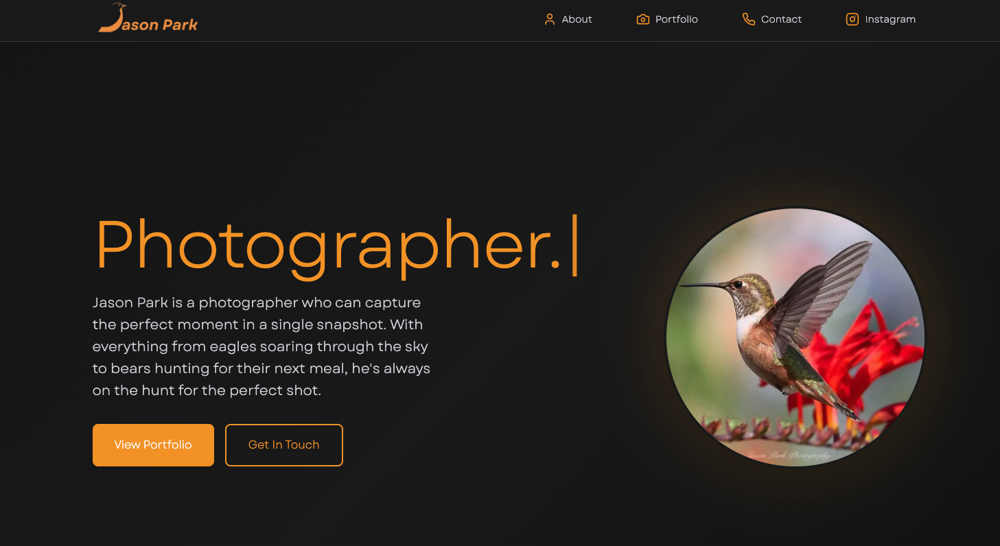

<div style="display: flex; gap: 10px; flex-wrap: 
nowrap;">
  
</div>

# Project Jaybird

A photography portfolio website showcasing the work of Jason Park, a wildlife photographer with over 40 years of experience capturing moments in nature.

This is a Next.js application that features a public-facing gallery, portfolio display, contact form, and an admin dashboard for managing and uploading new images.

https://www.jasonparkphotography.ca

<div style="display: flex; gap: 10px; flex-wrap: 
nowrap;">
  
</div>

## Features

The site includes a portfolio gallery with search functionality, a contact form that sends emails via Nodemailer, and an admin dashboard where authenticated users can upload and manage images through Cloudinary integration.

Authentication is handled through NextAuth with secure password hashing using bcrypt.

## Getting Started

First, install the dependencies

```bash
cd frontend
npm install
```

Create a `.env.local` file in the `frontend` directory with the following environment variables

```
ADMIN_USERNAME=your-username
ADMIN_PASSWORD_HASH=your-bcrypt-hash
NEXTAUTH_SECRET=your-nextauth-secret
NEXT_PUBLIC_CLOUDINARY_CLOUD_NAME=your-cloudinary-cloud-name
CLOUDINARY_API_KEY=your-cloudinary-api-key
CLOUDINARY_API_SECRET=your-cloudinary-api-secret
USER_EMAIL=your-email-for-contact-form
EMAIL_PASS=your-email-password
```

For the password hash, you can generate one using bcrypt. The authentication system automatically detects if the hash is base64 encoded or in standard bcrypt format.

Then run the development server

```bash
npm run dev
```

Open [http://localhost:3000](http://localhost:3000) with your browser to see the result.

## Project Structure

The main application code is in `frontend/src/app`. The public pages include the home page with a photo carousel, portfolio gallery, and contact form. The admin dashboard is located at `/admin/dashboard` and requires authentication.

API routes handle authentication, Cloudinary image management, and contact form submissions. Components are reusable pieces like the navigation bar, footer, gallery, and image cards.

## Tech Stack

Built with Next.js 15, React 19, and Tailwind CSS. Images are stored and served through Cloudinary. Email functionality uses Nodemailer, and authentication is handled with NextAuth.
